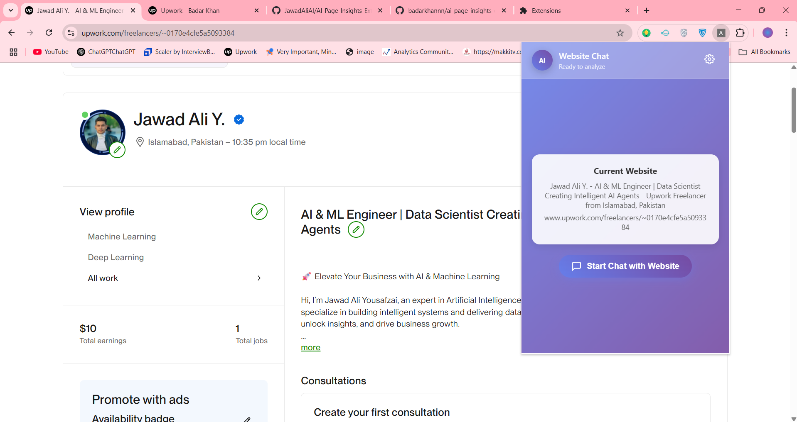
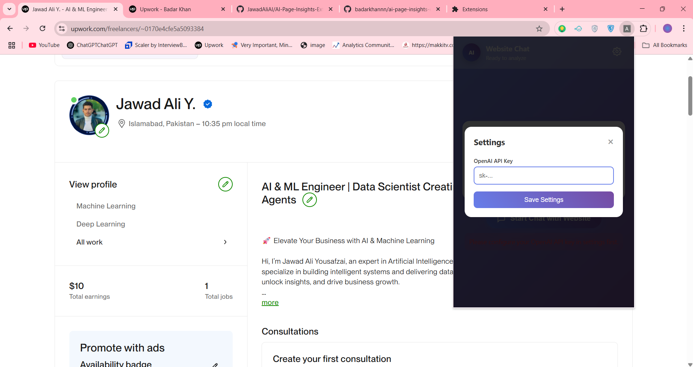
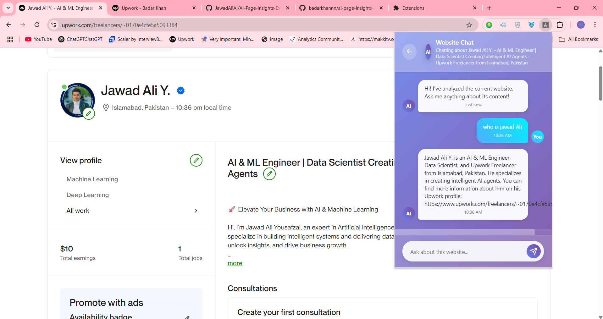

# ai-page-insights-extension

> A lightweight and fun Chrome extension that uses OpenAI’s LLM to answer questions, summarize pages, generate quizzes, and extract key points from the website you're currently viewing.



## What It Does

**ai-page-insights** is a browser extension that enhances your web browsing experience using AI. It can:

- **Summarize** the content of the current page.
- **Answer questions** based on the page context.
- **Create quizzes** related to the page content.
- **Extract key points** for quick takeaways.
- ***And Many More!***

All powered by OpenAI's language models, right from your browser popup!

## Project Structure

```
ai-page-insights-extension|
├── background.js       # Handles background tasks
├── content.js          # Injects scripts into web pages
├── manifest.json       # Chrome extension metadata
├── popup.html          # UI for the extension popup
└── popup.js            # Handles popup interactions and API calls
```

## Installation

> ⚠️ This project is a prototype and not yet published on the Chrome Web Store.

To run it locally:

1. Clone the repo:

   ```bash
   git clone repo
   ```
2. Go to `chrome://extensions/` in your browser.
3. Enable **Developer mode**.
4. Click on **Load unpacked** and select the project directory.

## Demo



###### Ask Question



**Example Use Cases:**

- Reading a long article? Click the extension to get a summary instantly.
- Want to test your knowledge? Let it auto-generate a quiz.
- Need to quickly extract important points from research or news? One click is all it takes.

## 🚧 Status

This project was built just for fun and experimentation. It’s not fully functional yet and may contain bugs or incomplete features.

**But... you’re welcome to fork it, enhance it, or contribute!**

## License

This project is open-source and available under the MIT License.

Made with ❤️ by [Jawad Ali](https://www.linkedin.com/in/jawad-ali-yousafzai-742a76356/)
